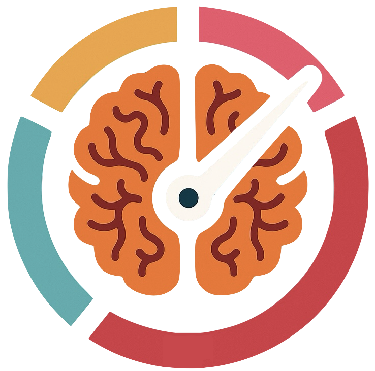
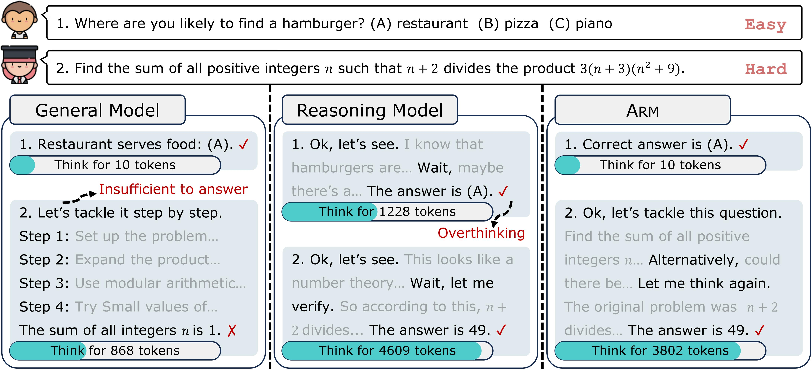

<div align=center>

</div>
<h1 align="center"> ARM: Adaptive Reasoning Model</h1>


<div align="center"> 

[](https://arxiv.org/abs/2505.20258)
[](https://team-arm.github.io/arm/) 
[](https://huggingface.co/arm-team) 

</div>

ARM—Adaptive Reasoning Model, a reasoning model capable of adaptively selecting appropriate reasoning formats based on the task at hand.

<p align="center">

</p>


## Updates

- 2025/05/27: Thrilled to release [ARM](https://team-arm.github.io/arm/): A reasoning model capable of adaptively selecting reasoning formats based on the task, achieving a better trade-off between effectiveness and efficiency!

## Data & Model
You can download our dataset and model from [🤗HuggingFace](https://huggingface.co/arm-team).

## Environments
This repository contains the codebase for SFT and RL based on [LLaMA-Factory](https://github.com/hiyouga/LLaMA-Factory) and [VeRL](https://github.com/volcengine/verl).
We use two separate conda environments for each stage:
```bash
# SFT
conda env create -f environment/llama_factory_env.yaml
conda activate arm_llama_factory

# RL + Router
wget https://repo.anaconda.com/miniconda/Miniconda3-latest-Linux-x86_64.sh -O miniconda.sh && bash miniconda.sh -b -p $HOME/miniconda && $HOME/miniconda/bin/conda init bash

/root/miniconda/bin/conda env create -f environment/verl_env.yaml
source /root/miniconda/etc/profile.d/conda.sh && conda activate arm_verl

conda env create -f environment/verl_env.yaml
conda activate arm_verl
pip3 install --force-reinstall torch==2.4.0 --index-url https://download.pytorch.org/whl/cu124
pip3 install flash-attn --no-build-isolation

## Stage1: SFT
```bash
conda activate arm_llama_factory
cd LLaMA-Factory
```
Make sure to specify the correct model path in the `.yaml` file.

### Train
```bash
CUDA_VISIBLE_DEVICES=0,1,2,3 llamafactory-cli train stage1_scripts/qwen2.5_7b/train.yaml
```
### Merge

```bash
llamafactory-cli export stage1_scripts/qwen2.5_7b/merge.yaml
```


## Stage2: RL
```bash
conda activate arm_verl
cd verl
```
Make sure to specify the correct model and data path in the `.sh` file.
### Data Process
```bash
# The training data is located in arm/verl/data/parquet.  
# Alternatively, you can prepare your own training data, e.g.:
python3 stage2_scripts/data_preprocess/gsm8k.py

# You can also prepare data for the instruction-guided mode used in evaluation, e.g.:
python3 stage2_scripts/data_preprocess/instruction_guided/gsm8k.py
```

### Train
```bash
bash stage2_scripts/trainer/run.sh
```

### Generate
```bash
# Adaptive Mode
bash stage2_scripts/generation/adaptive_run.sh

# Instruction-Guided Mode. Specify the reasoning format in the .sh file:
bash stage2_scripts/generation/instruction_guided_run.sh
```

### Evaluate
```bash
bash stage2_scripts/evaluation/run.sh
```

## 🔍Roadmap
[Work in Progress] Stay tuned!


## Contact

If you have any problems, please contact 
[Siye Wu](mailto:siyewu24@m.fudan.edu.cn) and
[Jian Xie](mailto:jianx0321@gmail.com).

## Citation Information

If our paper or related resources prove valuable to your research, we kindly ask for a citation. 

<a href="https://github.com/TEAM-ARM/ARM"></a>

```
@article{wu2025arm,
  title={ARM: Adaptive Reasoning Model},
  author={Wu, Siye and Xie, Jian and Zhang, Yikai and Chen, Aili and Zhang, Kai and Su, Yu and Xiao, Yanghua},
  journal={arXiv preprint arXiv:2505.20258},
  year={2025}
}
```
